# Applying Machine-Learning Models to Predict Credit Risk 

In this assignment, several machine-learning models were used to predict credit risk using free data from LendingClub. 

Credit risk poses an inherently imbalanced classification problem, the number of observations belonging to a high credit risk class tends to be significantly lower than a low credit risk class. Conventional machine learning algorithms do not perform well with class disruption and therefore, may produce biased and inaccurate results with imbalanced data.   

In the first part of the analysis, resampling algorithms are used to address the class imbalance problem by oversampling, undersampling, and using a combination approach on the training data. With the resampled data, `LogisticRegression` from Scikit-learn library was used to build logistic regression classifier models. 

In the second part of the analysis, two ensemble learning methods were constructed and compared. 

##### Resampling Algorithms: 
- `Naive Random Oversampler`
- `SMOTE` 
- `Cluster Centroids`
- `SMOTEENN` 

##### Ensemble Learning Methods: 
- `Balanced Random Forest Classifier`
- `Easy Ensemble AdaBoost Classifier`


LendingClub Data Analysis 
------
 
Before running the algorithms, the data from LendingClub was cleaned and prepared for analysis.  This included dropping null values and columns, and encoding categorical data using `get_dummies()`.  

The target outcome column data, that would be used in the analysis, was converted  to `low_risk` if the loan status was flagged as `Current`  and `high_risk` if the loan status was `Late (31-120 days)`, `Late (16-30 days)`, `Default`, or `In Grace Period`. 
  
The features and target outcome data were placed in new separate dataframes that would be further divided into training and testing data.  

The target values, low risk and high risk, returned an expected imbalanced problem. Within the dataset, there were 68,470 low risk values verse 347 high risk values. 

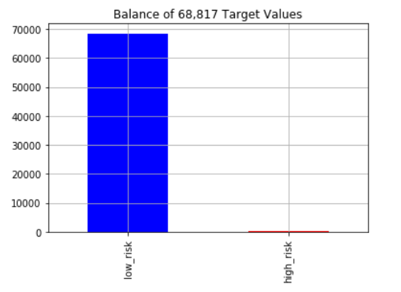 

From there, the data was split into training and testing data using `train_test_split` from Scikit-learn library. 

```X_train, X_test, y_train, y_test = train_test_split(X,y, random_state=1)```

The y_train data further indicates imbalanced classification. 

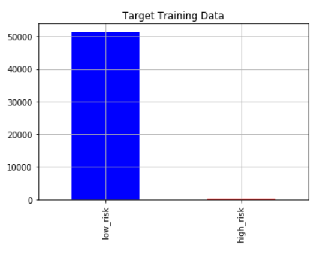

Resampling Algorithms, Training the Logistic Regression Model 
------

 The Naive Random and SMOTE Oversampling algorithms produced an equal number of 51366 observations. The Cluster Centroids undersampler produced an equal number of 246 observations. And the SMOTEENN combination resampler produced 51359 `high_risk` and 46660 `low_risk` observations. 

Using these resampled training datasets, models were fit with the `logistic regression classifier` and predicted using the test data. 

- ##### Naive Random, Oversampler

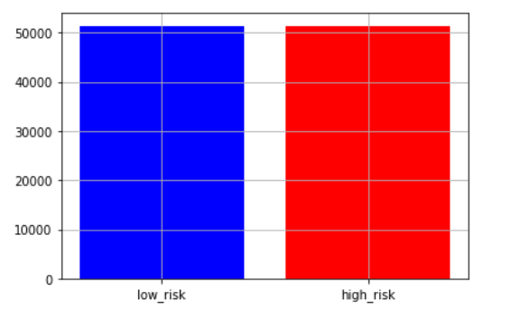


- ##### SMOTE, Oversampler


- ##### Cluster Centroids, Undersampler

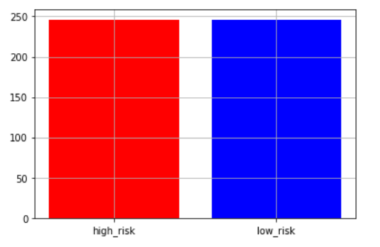


- ##### SMOTEENN, Combination

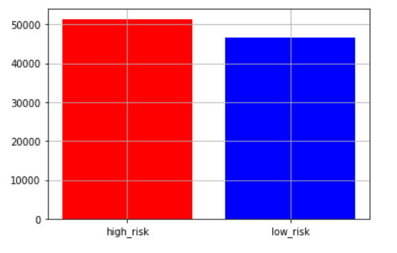


Model Performance Analysis 
----

To evaluate and compare performance, a balanced accuracy score, confusion matrix, and imbalanced classification report was generated for each model. 

The accuracy score measures the ratio of correctly predicted observations to the total observations. From the results below, SMOTE oversampling resulted in the highest accuracy score. 

A confusion matrix is used to describe the performance of a classification model to compare actual results with the model's predicted results. From the confusion matrix, precision and recall ratios can be measured. Precision is the ratio of correctly predicted positive observations to the total predicted positive observations. Recall is the ratio of correctly predicted positive observations to the all observations in the positive class. F1 score is the weighted average of Precision and Recall. 

Based on the results, SMOTE performed best across all metrics.  


|  Resampling Algorithms    | Balanced Accuracy Score | Recall Score|F1 Score     |   Geometric Mean Score |
| -------------             |:-------------:          | -----:      | -----:      |   ---                  |
| Naive Random              | 70.0%                   |0.69         |0.81         | 0.70                   |
| SMOTE                     | 72.0%                   |0.73         |0.84         | 0.72                   |
| Cluster Centroids         | 65.0%                   |0.48         |0.64         | 0.62                   |
| SMOTEENN                  | 69.0%                   |0.65         |0.78         | 0.69                   |


Imbalanced Classification Reports : 

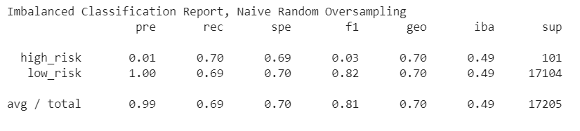


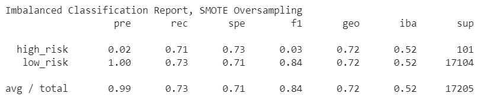


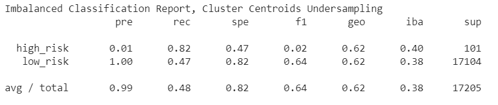


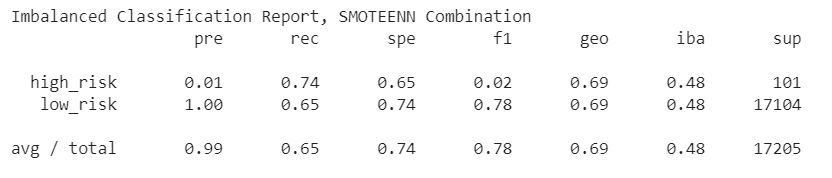


## Ensemble Learning

For the ensemble learners, 100 estimators were used for both models.

##### Balanced Random Forest Classifier Accuracy Score: 78.0%

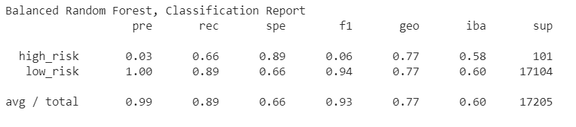

The top three features: 

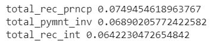

##### Easy Ensemble Classifier Accuracy Score: 93.0%

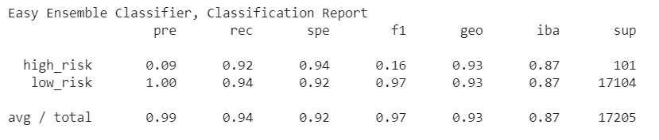

In conclusion, the Easy Ensemble Classifier had the best balanced accuracy score, recall score, and geometric score. 


