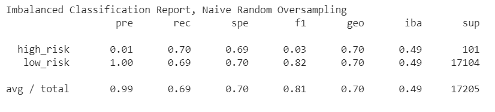
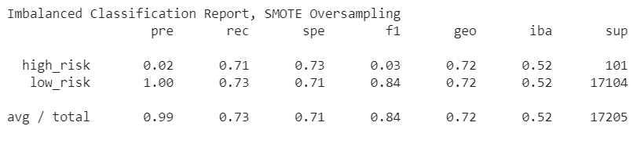
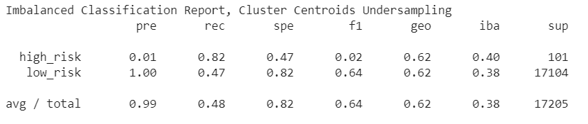
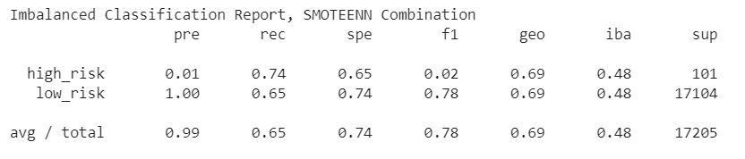
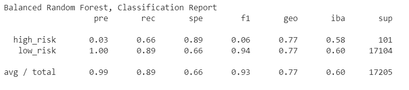
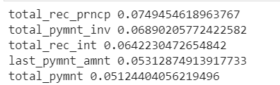
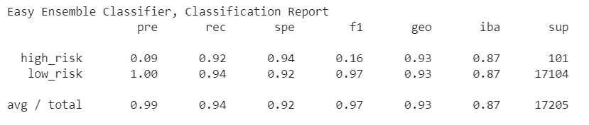
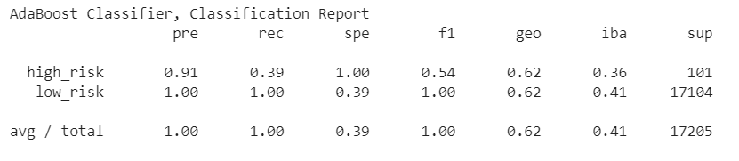

# Applying Machine-Learning Models to Predict Credit Risk 

In this assignment, several machine-learning models were used to predict credit risk using free data from LendingClub. The algorithms used in the analysis were selected to address the inherently imbalanced classification problem of credit risk. For each algorithm, a logistic regression classifier from sklearn.linear_model was used to resample the data. Then a balanced accuracy score, confusion matrix, and imbalanced classification report was generated to compare results. 

Before running the algorithms, the data from LendingClub was cleaned and prepared for analysis. This included dropping null values and columns, converting integer values to numerical data types, and encoding strings using get_dummies(). Once the data was in proper form, the features and target outcome data were placed in new dataframes and further split between testing and training. The target values, low risk and high risk, returned an expected imbalanced problem. Within the dataset, there were 68,470 high risk values verse 347 low risk values. To address this issue, multiple resampling models were tested and compared to determine which algorithm results in the best performance based on balanced accuracy score, recall score, and geometric mean score.  Below is a summary of results. 

### Naive Random Oversampler and SMOTE algorithms to oversample the data 

##### Naive Random Oversampling Balanced Accuracy Score: 70.0%

##### SMOTE Oversampling Balanced Accuracy Score: 72.0%

### Cluster Centroids algorithm to undersample the data 

##### Cluster Centroids Undersampling Balanced Accuracy Score: 65.0%

### SMOTEENN algorithm to over and under-sample the data 

##### SMOTEENN Combination Balanced Accuracy Score: 69.0%

In conclusion, the SMOTE oversampler model had the best balanced accuracy score, recall score, and geometric mean score.

## Ensemble Learning

##### Balanced Random Forest Classifier Accuracy Score: 78.0%

The top three features: 

##### Easy Ensemble Classifier Accuracy Score: 93.0%

##### AdaBoost Classifier Accuracy Score: 69.0%

In conclusion, the Easy Ensemble Classifier had the best balanced accuracy score, but the AdaBoost had the best recall and geometric score. 

