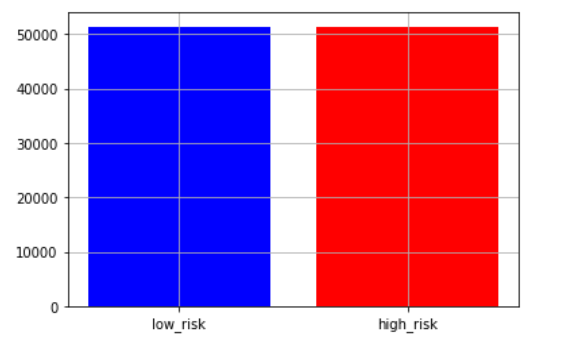

# Applying Machine-Learning Models to Predict Credit Risk 

In this assignment, several machine-learning models were used to predict credit risk using free data from LendingClub. 

Credit risk poses an inherently imbalalanced classification problem, the number of observations belonging to a high credit risk class tends to be significantly lower than a low credit risk class. Conventional machine learning algorithms do not take into account class disruption and therefore, may produce biased and inaccurate results.   

In the first part of the analysis, resampling algorithms are used to address the class imbalance problem by oversampling, undersampling, and using a combination approach on the training data. With the resampled data, `LogisticRegression` from Scikit-learn library was used to build logistic regression classifier models. 

In the second part of the analysis, two ensemble learning methods are constructed. 

##### Resampling Algorithms: 
- `Naive Random Oversampler`
- `SMOTE` 
- `Cluster Centroids`
- `SMOTEENN` 

##### Ensemble Learning Methods: 
- `Balanced Random Forest Classifier`
- `Easy Ensemble AdaBoost Classifier`


LendingClub Data Analysis 
------
 
Before running the algorithms, the data from LendingClub was cleaned and prepared for analysis.  This included dropping null values and columns, and encoding categorical data using `get_dummies()`.  

The target outcome column data, that would be used in the analysis, was converted  to `low_risk` if the loan status was flagged as `Current`  and `high_risk` if the loan status was `Late (31-120 days)`, `Late (16-30 days)`, `Default`, or `In Grace Period`. 
  
The features and target outcome data were placed in new separate dataframes that would be further divided into training and testing data.  

The target values, low risk and high risk, returned an expected imbalanced problem. Within the dataset, there were 68,470 low risk values verse 347 high risk values. 

 

From there, the data was split into training and testing data using `train_test_split` from Scikit-learn library. 

```X_train, X_test, y_train, y_test = train_test_split(X,y, random_state=1)```

The y_train data further indicates imbalanced classification. 


Resampling Algorithms, Training the Logistic Regression Model 
------

 The Naive Random and SMOTE Oversampling algorithms produced an equal number of 51366 observations. The Cluster Centroids undersampler produced an equal number of 246 observations. And the SMOTEENN combination resampler produced 51359 `high_risk` and 46660 `low_risk` observations. 

Using these resampled training datasets, models were fit with the `logistic regression classifier` and predicted using the test data. 

- ##### Naive Random, Oversampler


- ##### SMOTE, Oversampler




- ##### Cluster Centroids, Undersampler


- ##### SMOTEENN, Combination


Model Performance Analysis 
----

To evaluate and compare performance for each model, a balanced accuracy score, confusion matrix, and imbalanced classification report was generated. 

The accuracy score measures the ratio of correctly predicted observations to the total observations. From the results below, SMOTE oversampling resulted in a slightly higher accuracy score. 

A confusion matrix is a table that is used to describe the performance of a classification model on a set of test data for which the true values are known. From the confusion matrix, precision and recall ratios can be measured. Precision is the ratio of correctly predicted positive observations to the total predicted positive observations. Recall is the ratio of correctly predicted positive observations to the all observations in actual class
Recall = TP/TP+FN

F1 score - F1 Score is the weighted average of Precision and Recall. Therefore, this score takes both false positives and false negatives into account. Intuitively it is not as easy to understand as accuracy, but F1 is usually more useful than accuracy, especially if you have an uneven class distribution. Accuracy works best if false positives and false negatives have similar cost. If the cost of false positives and false negatives are very different, it’s better to look at both Precision and Recall. In our case, F1 score is 0.701.


|  Algorithms               | Balanced Accuracy Score | Recall Score|F1 Score     |   Geometric Mean Score |
| -------------             |:-------------:          | -----:      | -----:      |   ---                  |
| Naive Random Oversampler  | 70.0%                   |0.69         |0.81         | 0.70                   |
| SMOTE Oversampling        | 72.0%                   |0.73         |0.84         |  0.72                  |
| Cluster Centroids         | 65.0%                   |0.48         |0.64         | 0.62                   |
| SMOTEENN                  | 69.0%                   |0.65         |0.78         | 0.69                   |


Imbalanced Classification Report: 


## Ensemble Learning

For the ensemble learners, use 100 estimators for both models

1. Train the model using the quarterly data from LendingClub provided in the `Resource` folder.
2. Calculate the balanced accuracy score from `sklearn.metrics`.
3. Print the confusion matrix from `sklearn.metrics`.
4. Generate a classification report using the `imbalanced_classification_report` from imbalanced learn.
5. For the balanced random forest classifier only, print the feature importance sorted in descending order (most important feature to least important) along with the feature score.

##### Balanced Random Forest Classifier Accuracy Score: 78.0%


The top three features: 


##### Easy Ensemble Classifier Accuracy Score: 93.0%


In conclusion, the Easy Ensemble Classifier had the best balanced accuracy score, recall score, and geometric score. 


